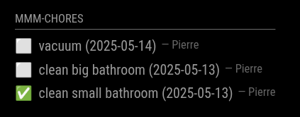
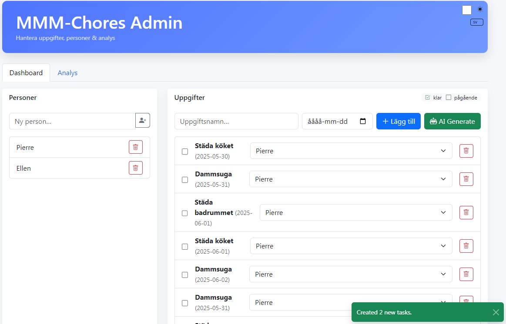
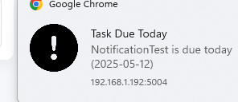

# MMM-Chores

**MMM-Chores** is a module for [MagicMirror²](https://github.com/MagicMirrorOrg/MagicMirror) that allows you to manage your household chores.

[](https://ko-fi.com/J3J2EARPK)

It provides an admin interface where you can add, edit, and delete tasks. You can also set due dates and assign tasks to different persons. The module displays the tasks on your MagicMirror, allowing you to keep track of your household chores at a glance.

The data is stored in `data.json` to make the data persistent between restarts.
Task order is also saved (deleted tasks are ignored) so any manual reordering in
the admin UI will survive page refreshes and module restarts.

*Update 2025-07-07: Analytics boards can now be displayed on the mirror

## Screenshots
  




## Installation

```bash
cd ~/MagicMirror/modules
git clone https://github.com/PierreGode/MMM-Chores
cd MMM-Chores
npm install
```

## Update

```bash
cd ~/MagicMirror/modules/MMM-Chores
git pull
npm install
```

## Configuration
in /MagicMirror/config/config.js
```js
{
  module: "MMM-Chores",
  position: "bottom_right",
  header: "Chores",
  config: {
    updateInterval: 60 * 1000,
    adminPort: 5003,
    showAnalyticsOnMirror: false, // show analytics charts on the mirror
    openaiApiKey: "your-openApi-key-here",
    useAI: true,        // hide AI features when false
    showPast: true,    // show unfinished tasks from past days
    textMirrorSize: "small", // small, medium or large
    dateFormatting: "MM-DD",  // Date format pattern to display task dates.
                              // Use tokens like 'yyyy', 'mm', 'dd'.
                              // Set to "" to hide the date completely.
    leveling: {               // optional leveling system
      enabled: true,   // enable or disable leveling system
      yearsToMaxLevel: 3,
      choresPerWeekEstimate: 4,
      maxLevel: 100
    },
    levelTitles: [            // titles for every 10 levels
      "Junior",
      "Apprentice",
      "Journeyman",
      "Experienced",
      "Expert",
      "Veteran",
      "Master",
      "Grandmaster",
      "Legend",
      "Mythic"
    ]
  }
},
```

levels could also be rewards
```js
    levelTitles: [            // titles for every 10 levels
      "10 euro game giftcard",
      "Movie Night Voucher",
      "Dinner at Favorite Restaurant",
      "Weekend Brunch Voucher",
      "Gadget Accessory (e.g. Headphones)",
      "Spa or Relaxation Package",
      "Adventure Experience Voucher",
      "Weekend trip",
      "Adventureland",
      "Travel destination"
    ]
```


When `leveling.enabled` is set to `false`, both the MagicMirror display and the
admin portal hide any level badges and reward titles.

### Level titles

For level **N** (1 ≤ N ≤ 100), the module chooses a title based on the ten-level
interval that `N` belongs to. Level 1–10 uses the first entry in `levelTitles`,
11–20 the second entry, and so on. The boundaries are inclusive, so level 10
still uses the first title and 11 uses the second.

Specify your own titles by providing a `levelTitles` array with exactly ten
strings in the configuration. If omitted, the defaults shown above are used.

### Custom titles per person

You can override the global rewards for an individual by using the
`customLevelTitles` object. The keys are the person's name and the value should
be an array of ten titles.

```js
customLevelTitles: {
  Pierre: [
    "10 euro game giftcard",
    "Movie Night Voucher",
    "Dinner at Favorite Restaurant",
    "Weekend Brunch Voucher",
    "Gadget Accessory (e.g. Headphones)",
    "Spa or Relaxation Package",
    "Adventure Experience Voucher",
    "Weekend trip",
    "Adventureland",
    "Travel destination"
  ]
}
```

Any person not listed in `customLevelTitles` falls back to the global
`levelTitles` array or the defaults.

### Per-person levels

Each person earns experience separately. Their current level and title are stored
in `data.json` and shown next to the name in the admin interface. On the
MagicMirror display the assigned person's name will include a small
`lvlX` badge.

## Admin Interface

Go to http://yourmirrorIP:5003/ #page will be reachable within same network.
> [!CAUTION]
> DO NOT expose application with portforward

## Push Notifications

If you wish to use push notifications follow guide below. 



### 1. in MagicMirror/modules/MMM-Chores create a folder certs

```bash
mkdir MagicMirror/modules/MMM-Chores/certs
```

### 2. Generate a private key in MMM-Chores/certs

```bash
openssl genrsa -out server.key 2048
```

### 3. Create a certificate signing request (CSR)

```bash
openssl req -new -key server.key -out server.csr -subj "/C=SE/ST=Stockholm/L=Stockholm/O=Home/CN=192.168.1.192" <--- YOUR IP
```

### 4. Generate a self-signed cert valid for 1 year

```bash
openssl x509 -req -in server.csr -signkey server.key -out server.crt -days 365
```

copy /certs/server.crt and install on your devices.

browse to https://yourmirrorIP:5004/ and allow push notifications.

> [!NOTE]
> And yes everything will yell unsafe, warning warning, Not Secure, that is what happens when you do a selfsigned certificate and not a micrsoft signed cert for loads of money ;P

