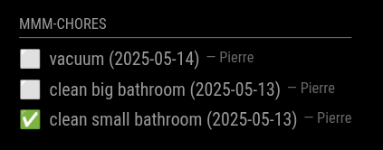
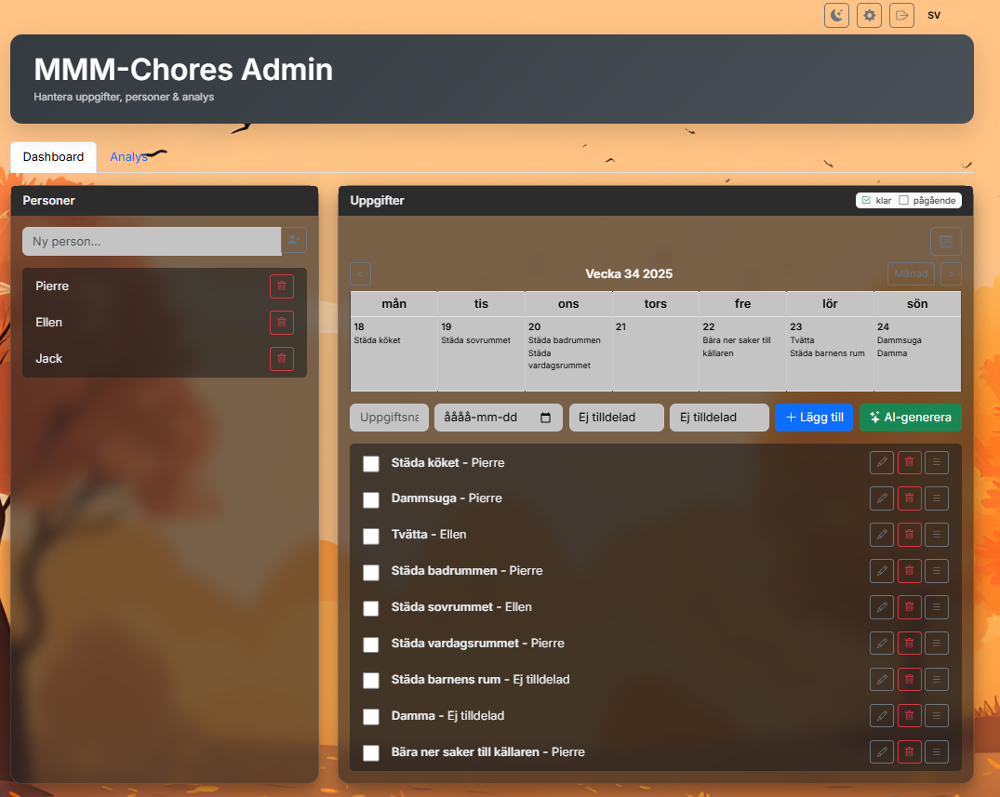
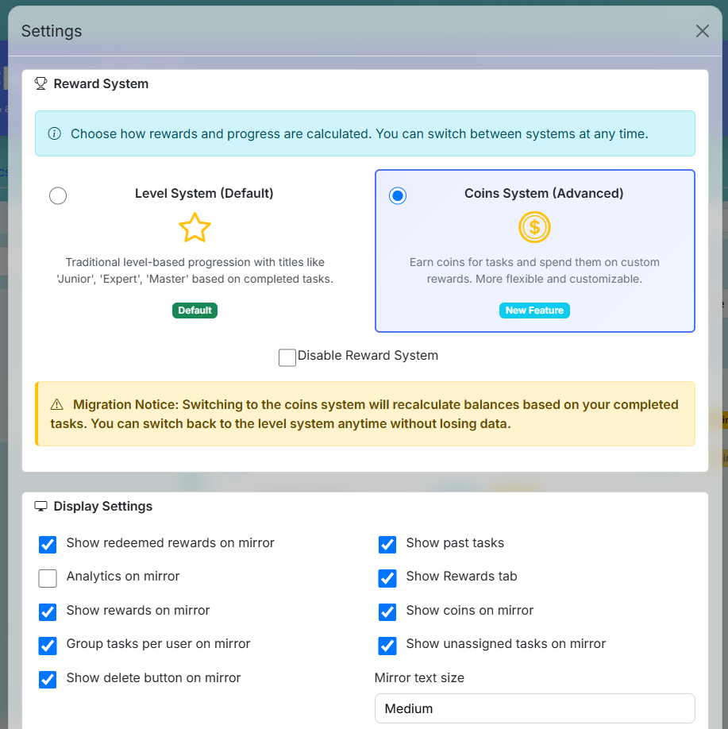
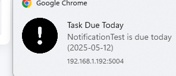

# MMM-Chores

**MMM-Chores** is a module for [MagicMirror²](https://github.com/MagicMirrorOrg/MagicMirror) that allows you to manage your household chores.

[](https://ko-fi.com/J3J2EARPK)

It provides an admin interface where you can add, edit, and delete tasks. You can also set due dates and assign tasks to different persons. Tasks may be one-time or recur daily, weekly, monthly, or yearly. The module displays the tasks on your MagicMirror, allowing you to keep track of your household chores at a glance.

The data is stored in `data.json` so it persists across restarts.
Use the drag handle ("burger" icon) to reorder tasks in the admin UI. The updated order is saved to `data.json` and automatically reloaded, so it survives page refreshes and restarts. Note: drag-to-reorder is only available when "Group by person" is turned off.

## Screenshots







## Installation

```bash
cd ~/MagicMirror/modules
git clone https://github.com/PierreGode/MMM-Chores
cd MMM-Chores
npm install
```

## Update

```bash
cd ~/MagicMirror/modules/MMM-Chores
git pull
npm install
```

## Configuration

Most settings are configured from the admin portal via the cogwheel **Settings** button — no need to edit files. Only a handful of options must be set in `config.js`, mainly API keys and the admin port.

Add the module to `config.js` like so:

```js
{
  module: "MMM-Chores",
  position: "bottom_right",
  header: "Chores",
  config: {
    updateInterval: 60 * 1000,
    adminPort: 5003,
    openaiApiKey: "your-openApi-key here",
    pushoverApiKey: "your-pushover-api-key",
    pushoverUser: "your-pushover-user-key",
    login: false,
    users: [
      { username: "admin", password: "secret", permission: "write" },
      { username: "steve", password: "", permission: "regular" }, //leave password empty for no password
      { username: "viewer", password: "viewer", permission: "read" }
    ],
    settings: "unlocked", //  set a 6 digit pin like "000000" to lock settings popup with a personal pin, change 000000 to any 6 digit password you want, or comment this out to lock settings completely
// other options can be set in the admin portal
    levelTitles: [
    // titles for every 10 levels
      "Junior",
      "Apprentice",
      "Journeyman",
      "Experienced",
      "Expert",
      "Veteran",
      "Master",
      "Grandmaster",
      "Legend",
      "Mythic"
    ],
    customLevelTitles: {
      NameOfTheUser: [
        "10 euro game giftcard",
        "Movie Night Voucher",
        "Dinner at Favorite Restaurant",
        "Weekend Brunch Voucher",
        "Gadget Accessory (e.g. Headphones)",
        "Spa or Relaxation Package",
        "Adventure Experience Voucher",
        "Weekend trip",
        "Adventureland",
        "Travel destination"
      ]
    }
  }
},
```

When `login` is set to `true`, define one or more `users` with `username`, `password` and `permission`:
- `"write"` — full access, can create, edit and delete tasks
- `"regular"` — sees only their own assigned tasks and can set their own background
- `"read"` — can view all tasks but cannot create, delete or modify them

### Settings managed from the admin portal

The following are all controlled via the cogwheel **Settings** button in the admin interface — you do **not** need to add them to `config.js`:

- **Show past tasks** — whether overdue incomplete tasks stay visible on the mirror. Completed past tasks are always hidden.
- **Show unassigned tasks on mirror** — when enabled, tasks with no assigned person appear on the mirror with a touch-friendly **Assign…** dropdown so any household member can claim them directly on the touchscreen. Assigning a recurring task this way only affects that single occurrence — the rest of the series stays unassigned.
- **Group tasks by person** — groups the mirror display by assignee instead of a single list.
- **Show delete button on mirror** — adds a delete button on the mirror for past assigned incomplete tasks.
- **Text size, date format, background image** — appearance of the mirror display.
- **Reward system** — switch between the level system and the coins system (see below). Safe to switch at any time without losing data.
- **AI features** — enable/disable the chatbot and text-to-speech.
- **Pushover notifications** — enable/disable and set a daily reminder time.
- **Auto-update** — automatically runs `git pull` once per day at 04:00 to keep the module up to date.

### Level titles

For level **N** (1 ≤ N ≤ 100), the module chooses a title based on the ten-level interval that `N` belongs to. Level 1–10 uses the first entry in `levelTitles`, 11–20 the second entry, and so on. The boundaries are inclusive, so level 10 still uses the first title and 11 uses the second.

Specify your own titles by providing a `levelTitles` array with exactly ten strings in `config.js`. If omitted, the defaults shown above are used. Level titles can also be used as rewards:

> [!IMPORTANT]
> `levelTitles` is only read from `config.js` on the **first boot** (or when no value is stored yet). After that, the value saved in `data.json` takes over and your `config.js` entry is ignored. This means:
> - Changing `levelTitles` in `config.js` after first run will have **no effect**.
> - To change titles after first run, you need to edit `data.json` directly (stop MagicMirror first, find the `"levelTitles"` key in the `settings` object, edit and save, then restart).
> - Per-person titles (`customLevelTitles`) work the same way, but can also be updated from the admin interface via the gift icon on each person.

```js
levelTitles: [            // titles for every 10 levels
  "10 euro game giftcard",
  "Movie Night Voucher",
  "Dinner at Favorite Restaurant",
  "Weekend Brunch Voucher",
  "Gadget Accessory (e.g. Headphones)",
  "Spa or Relaxation Package",
  "Adventure Experience Voucher",
  "Weekend trip",
  "Adventureland",
  "Travel destination"
]
```

### Custom titles per person

You can override the global titles for an individual by using the `customLevelTitles` object in `config.js`. The keys are the person's name and the value should be an array of ten titles.

```js
customLevelTitles: {
  NameOfTheUser: [
    "10 euro game giftcard",
    "Movie Night Voucher",
    "Dinner at Favorite Restaurant",
    "Weekend Brunch Voucher",
    "Gadget Accessory (e.g. Headphones)",
    "Spa or Relaxation Package",
    "Adventure Experience Voucher",
    "Weekend trip",
    "Adventureland",
    "Travel destination"
  ]
}
```

Any person not listed in `customLevelTitles` falls back to the global `levelTitles` array or the defaults.

Custom reward titles per person can also be edited directly from the admin interface: in the **People** section, click the gift icon next to a person's name to open their personal reward titles editor.

### Per-person levels

Each person earns experience separately. Their current level and title are stored in `data.json` and shown next to the name in the admin interface. On the MagicMirror display the assigned person's name will include a small `lvlX` badge.

When the level/reward system is disabled (Settings → Reward System → Disable Reward System), the mirror and admin hide all level badges and reward titles.


## Admin Interface

Go to `http://yourmirrorIP:5003/` — the page is reachable from any device on the same network.

> [!CAUTION]
> DO NOT expose application with portforward
> <p></p> No.. the login will not protect you, a trained goldfish can hack it.


## Push Notifications

Alternatively, you can use [Pushover](https://pushover.net/) by providing both a `pushoverApiKey` and `pushoverUser` in your module config and enabling Pushover in the admin settings.

You can also specify a daily reminder time in the admin settings to receive a Pushover message listing unfinished tasks due today or earlier.



### Quick SSL setup script

If you're running the mirror on Linux, you can auto-generate the required certificates by executing `./generate_certs.sh` from the module root. The script detects your primary IP, creates the `certs` folder inside `~/MagicMirror/modules/MMM-Chores/`, and outputs ready-to-use `server.key`, `server.csr`, and `server.crt` files.

### 1. in MagicMirror/modules/MMM-Chores create a folder certs

```bash
mkdir MagicMirror/modules/MMM-Chores/certs
```

### 2. Generate a private key in MMM-Chores/certs

```bash
openssl genrsa -out server.key 2048
```

### 3. Create a certificate signing request (CSR)

```bash
openssl req -new -key server.key -out server.csr -subj "/C=SE/ST=Stockholm/L=Stockholm/O=Home/CN=192.168.1.192" <--- YOUR IP
```

### 4. Generate a self-signed cert valid for 1 year

```bash
openssl x509 -req -in server.csr -signkey server.key -out server.crt -days 365
```

copy /certs/server.crt and install on your devices.

browse to https://yourmirrorIP:5004/ and allow push notifications.

> [!NOTE]
> And yes everything will yell unsafe, warning warning, Not Secure, that is what happens when you do a self-signed certificate and not a proper signed cert. You can do it correctly by paying loads of money ;). Alternatively going through a learning curve for free services like [letsencrypt](https://letsencrypt.org/) is obviously also an option


## ✨ New Features (June 2026)

### 🪞 Mirror Display Options

Expanded control over what appears on the mirror, with particular attention to coin-based reward visibility:

- **Coins on mirror** — show each person's current coin balance directly on the mirror display, so everyone can see their progress at a glance.
- **Rewards catalogue on mirror** — display the full list of available rewards and their coin costs on the mirror, so household members always know what they're working towards.
- **Redeemed rewards on mirror** — show recently claimed rewards above the task list, celebrating who redeemed what.
- **Group tasks by person** — organize the mirror display by assignee, making it easy to see at a glance whose turn it is for which chore.
- **Assign unowned tasks on the mirror** — unassigned tasks show a touch-friendly dropdown on the mirror itself, so any household member can claim a task without opening the admin page.
- **Delete obsolete tasks on the mirror** — a delete button can now be shown on the mirror for past incomplete tasks, making it easy to clear out tasks that are no longer relevant.

All of these options are toggled from the admin portal under **Settings → Display Settings** — no config file changes needed.

### 🐛 Fixed: Recurring task duplication

Resolved an issue where recurring tasks could appear multiple times in the list. Tasks that had accumulated overdue duplicates can be cleaned up using the **Run Temporary Data Fix** button in **Settings → Maintenance Tools**.

---

## ✨ New Features (dec 2025)

### 🔄 Enhanced Recurring Options
- **Weekdays**: Monday to Friday
- **Weekends**: Saturday to Sunday

### Mirror options
- **Rewards**: show claimed rewards by whom on the mirror

### Screen Mode
- **Fullscreen dashboard**: Launch an always-on display mode tailored for tablets and wall screens, keeping chores visible without the admin chrome.

### Filters
- **Group by person**: Quickly filter and group the task list by assignee to focus on what each person needs to do next.

### 🎯 Point-Based Rewards
- **Rewards in Pushover**: get better notifikations to pushover about rewards, and now with language support.

### 🤖 AI Chatbot
- **Smart Assistant**: Integrated OpenAI-powered chatbot in the admin dashboard.
- **Voice Interaction**: Speak to your chores list! (Requires SSL/HTTPS).
- **Text-to-Speech**: Hear responses with six natural-sounding AI voices.  ( ssl cert is needed "https" for microphone to work)
- **Context Aware**: Ask about upcoming tasks, people's points, or available rewards.

### Users
- **New role: regular**
- **Regular access**: Regular users only see their assigned tasks and can personalize user-specific settings such as their own background.

## ✨ New Features (October 2025)

**Major Update**: Added comprehensive point-based reward system and enhanced recurring options! See [NEW_FEATURES.md](docs/NEW_FEATURES.md) for complete details.

### 🎯 Point-Based Rewards
- **Custom Points**: Assign custom point values to each chore
- **Flexible Rewards**: Create rewards that cost specific amounts of points
- **Automatic Tracking**: Points are automatically awarded when tasks are completed
- **Email Notifications**: Optional email notifications when rewards are redeemed

---

> *Update 2025-08-04: most settings are moved to admin webpage*
>
> *Update 2025-08-20: added optional login with possibility to add both write permission user and read only user. Added Pushover notification possibility + configuration to set daily reminders at specific time. Added background images "4 seasons". Reworked task list, moved up user assignment to creation space. Reworked edit option to be a form to be able to update task description, user and date.*
