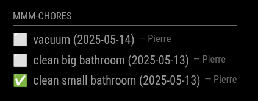

# MMM-Chores

**MMM-Chores** es un módulo para [MagicMirror²](https://github.com/MagicMirrorOrg/MagicMirror) que te permite gestionar las tareas del hogar.

[](https://ko-fi.com/J3J2EARPK)

Proporciona una interfaz de administración donde puedes añadir, editar y eliminar tareas. También puedes establecer fechas límite y asignar tareas a diferentes personas. Las tareas pueden ser únicas o repetirse diariamente, semanalmente, mensualmente o anualmente. El módulo muestra las tareas en tu MagicMirror, permitiéndote llevar un seguimiento de las tareas domésticas de un vistazo.

Los datos se almacenan en `data.json` para que persistan entre reinicios.
Usa el asa de arrastre (icono de "hamburguesa") para reordenar las tareas en la interfaz de administración. El
orden actualizado se guarda en `data.json` y se recarga automáticamente, por lo que
sobrevive a refrescos de página y reinicios.

La configuración **Mostrar tareas pasadas** te permite alternar si las tareas vencidas que aún no se han completado deben seguir siendo visibles en el espejo. Las tareas pasadas completadas siempre están ocultas.

*Actualización 2025-08-04: la mayoría de las configuraciones se trasladaron a la página de administración*

## Capturas de pantalla




## Instalación

```bash
cd ~/MagicMirror/modules
git clone https://github.com/PierreGode/MMM-Chores
cd MMM-Chores
npm install
```

## Actualización

```bash
cd ~/MagicMirror/modules/MMM-Chores
git pull
npm install
```

## Configuración
La mayoría de los ajustes ahora se pueden editar en el portal de administración mediante el botón de engranaje **Settings**.
Una opción adicional **Enable autoupdate** puede obtener los últimos cambios mediante `git pull` y recargar el módulo automáticamente. Las actualizaciones automáticas se ejecutan una vez al día a las **04:00** hora local.
Las notificaciones de Pushover se pueden activar o desactivar desde el portal de administración, mientras que `pushoverApiKey` y `pushoverUser` deben definirse en tu `config.js` de MagicMirror.
También puedes especificar una hora de recordatorio diaria en la configuración del administrador para recibir un mensaje de Pushover con las tareas sin completar vencidas hoy o antes.
Añade el módulo a `config.js` así:
```js
{
  module: "MMM-Chores",
  position: "bottom_right",
  header: "Chores",
  config: {
    updateInterval: 60 * 1000,
    adminPort: 5003,
    openaiApiKey: "your-openApi-key here",
    pushoverApiKey: "your-pushover-api-key",
    pushoverUser: "your-pushover-user-key",
    login: false,
    users: [
      { username: "admin", password: "secret", permission: "write" },
      { username: "viewer", password: "viewer", permission: "read" }
    ],
    settings: "unlocked", // establece un PIN de 6 dígitos como "000000" para bloquear la ventana de configuración con un PIN personal, cambia 000000 a cualquier contraseña de 6 dígitos que quieras o comenta esta línea para bloquear totalmente la configuración
// otras opciones se pueden definir en el portal de administración
    levelTitles: [
    // títulos para cada 10 niveles
      "Junior",
      "Aprendiz",
      "Oficial",
      "Experimentado",
      "Experto",
      "Veterano",
      "Maestro",
      "Gran maestro",
      "Leyenda",
      "Mítico"
    ]
  }
},
```

Cuando `login` se establece en `true`, define uno o más `users` con `username`, `password` y `permission` (`"read"` o `"write"`). Los usuarios con permiso de lectura pueden ver todas las tareas pero no pueden crearlas, eliminarlas ni modificarlas.

los niveles también pueden ser recompensas
```js
    levelTitles: [            // títulos para cada 10 niveles
      "Tarjeta regalo de juego de 10 euros",
      "Vale para noche de cine",
      "Cena en restaurante favorito",
      "Vale para brunch de fin de semana",
      "Accesorio tecnológico (por ej. auriculares)",
      "Paquete de spa o relajación",
      "Vale para experiencia de aventura",
      "Viaje de fin de semana",
      "Parque de atracciones",
      "Destino de viaje",
    ]
```

Cuando `leveling.enabled` se establece en `false`, tanto la pantalla de MagicMirror como el
portal de administración ocultan cualquier insignia de nivel y títulos de recompensa.

### Títulos de nivel

Para el nivel **N** (1 ≤ N ≤ 100), el módulo elige un título según el intervalo de diez niveles al que pertenece `N`. El nivel 1–10 utiliza la primera entrada en `levelTitles`, 11–20 la segunda entrada, y así sucesivamente. Los límites son inclusivos, por lo que el nivel 10 todavía usa el primer título y el 11 usa el segundo.

Especifica tus propios títulos proporcionando un arreglo `levelTitles` con exactamente diez cadenas en la configuración. Si se omite, se usan los valores predeterminados mostrados arriba.

### Títulos personalizados por persona

Puedes sobrescribir las recompensas globales para un individuo usando el
objeto `customLevelTitles`. Las claves son el nombre de la persona y el valor debe
ser un arreglo de diez títulos.

```js
customLevelTitles: {
  NameOfTheUser: [
    "Tarjeta regalo de juego de 10 euros",
    "Vale para noche de cine",
    "Cena en restaurante favorito",
    "Vale para brunch de fin de semana",
    "Accesorio tecnológico (por ej. auriculares)",
    "Paquete de spa o relajación",
    "Vale para experiencia de aventura",
    "Viaje de fin de semana",
    "Parque de atracciones",
    "Destino de viaje",
  ]
}
```

Cualquier persona no listada en `customLevelTitles` vuelve al arreglo global
`levelTitles` o a los valores predeterminados.

### Niveles por persona

Cada persona gana experiencia por separado. Su nivel y título actuales se almacenan
en `data.json` y se muestran junto al nombre en la interfaz de administración. En la
pantalla de MagicMirror el nombre de la persona asignada incluirá una pequeña
insignia `lvlX`.

## Interfaz de administración

Ve a http://yourmirrorIP:5003/ #la página será accesible dentro de la misma red.
> [!CAUTION]
> NO expongas la aplicación mediante reenvío de puertos

## Notificaciones Push

Si deseas usar notificaciones push sigue la guía a continuación.
Alternativamente, puedes usar [Pushover](https://pushover.net/) proporcionando `pushoverApiKey` y `pushoverUser` en la configuración del módulo y habilitando Pushover en la configuración del administrador.


### 1. En MagicMirror/modules/MMM-Chores crea una carpeta certs

```bash
mkdir MagicMirror/modules/MMM-Chores/certs
```

### 2. Genera una clave privada en MMM-Chores/certs

```bash
openssl genrsa -out server.key 2048
```

### 3. Crea una solicitud de firma de certificado (CSR)

```bash
openssl req -new -key server.key -out server.csr -subj "/C=SE/ST=Stockholm/L=Stockholm/O=Home/CN=192.168.1.192" <--- TU IP
```

### 4. Genera un certificado autofirmado válido por 1 año

```bash
openssl x509 -req -in server.csr -signkey server.key -out server.crt -days 365
```

copia `/certs/server.crt` e instálalo en tus dispositivos.

Navega a https://yourmirrorIP:5004/ y permite las notificaciones push.

> [!NOTE]
> Sí, todo gritará inseguro, advertencia, No seguro; eso es lo que ocurre cuando se utiliza un certificado autofirmado y no un certificado firmado por Microsoft por mucho dinero ;P

